# Appendix B: Markov Blankest and DAGs

## ($\alpha$ = 5%)

```{r full-dag-pc-full, echo=FALSE, fig.cap="Full DAG for the PC with all covariates model.", out.width="75%", fig.align='center'}
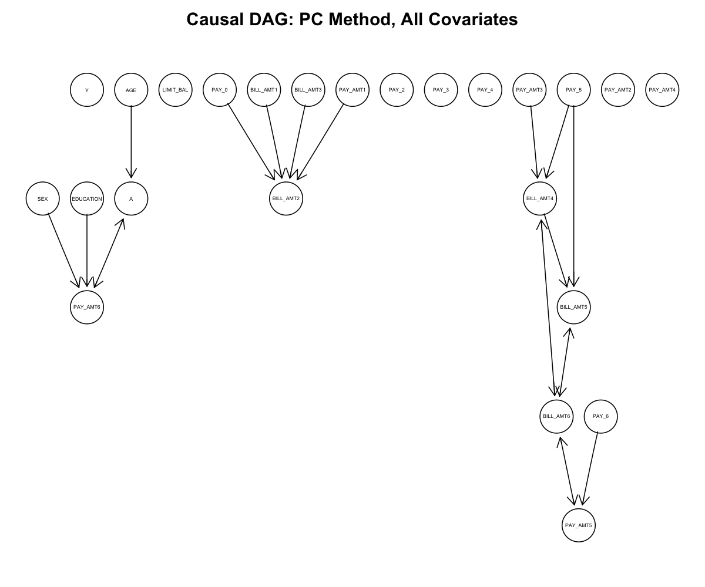
```

```{r consensus-dag-pc-full, echo=FALSE, fig.cap="Consensus DAG (edges included if they are in over 50% of the bootstraps) for the PC with all covariates model.", out.width="75%", fig.align='center'}
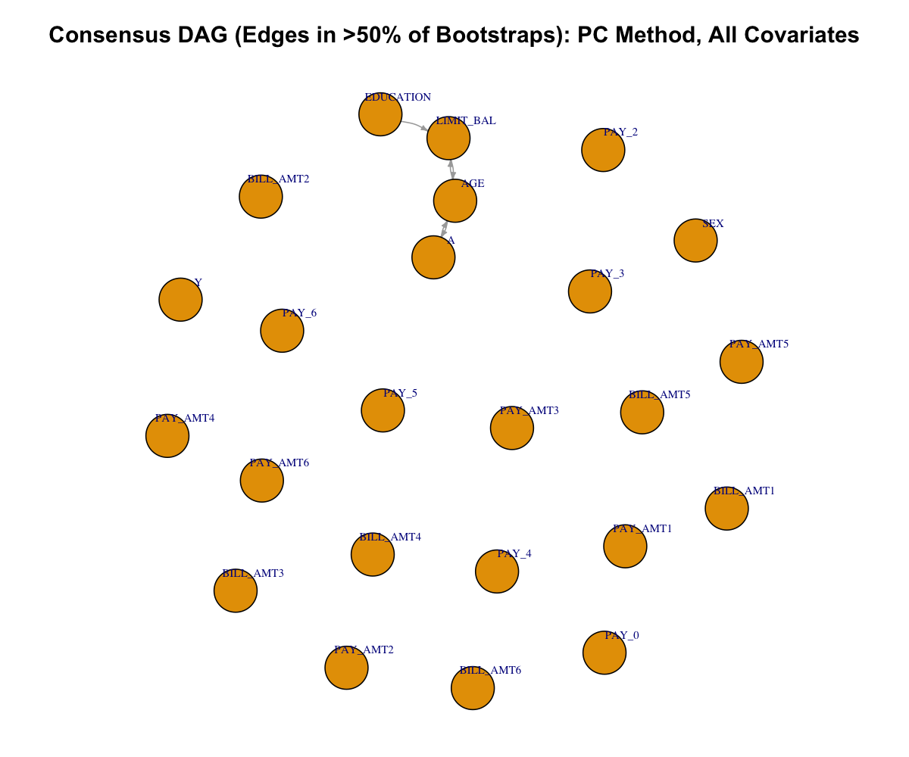
```

```{r full-dag-pc-limited-cov, echo=FALSE, fig.cap="Full DAG for the PC with limited covariates model.", out.width="50%", fig.align='center'}
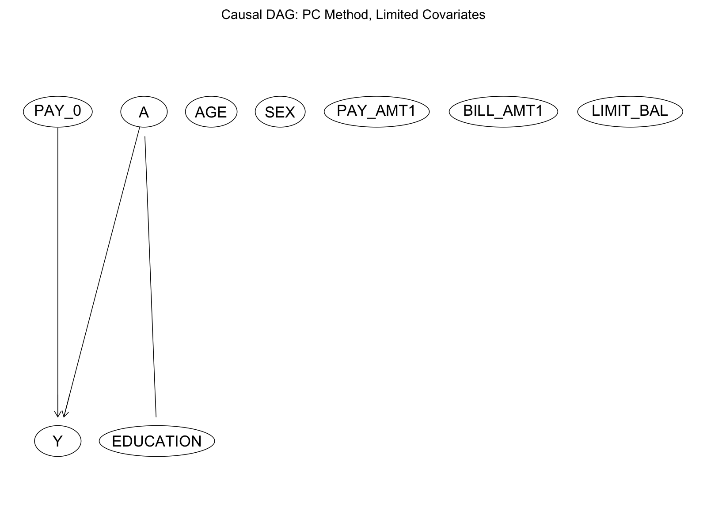
```

```{r full-dag-rank-pc, echo=FALSE, fig.cap="Full DAG for the Rank PC model.", out.width="75%", fig.align='center'}
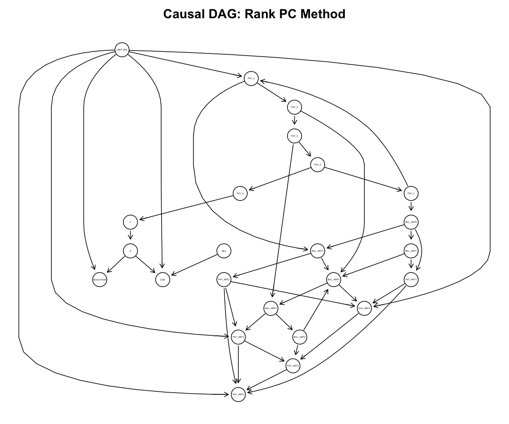
```
```{r local-discovery-markov-blanket-y-boostrapped, echo=FALSE, fig.cap="Local Discovery (Inter-IAMB, Ranked Data): Bootstrapped Markov Blanket for Y", out.width="75%", fig.align='center'}
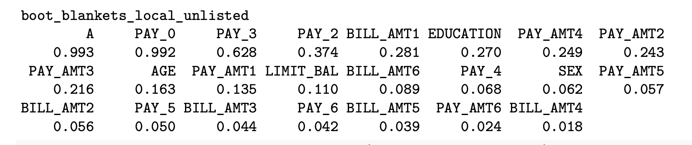
```
```{r local-discovery-markov-blanket-a-boostrapped, echo=FALSE, fig.cap="Local Discovery (Inter-IAMB, Ranked Data): Bootstrapped Markov Blanket for A", out.width="75%", fig.align='center'}
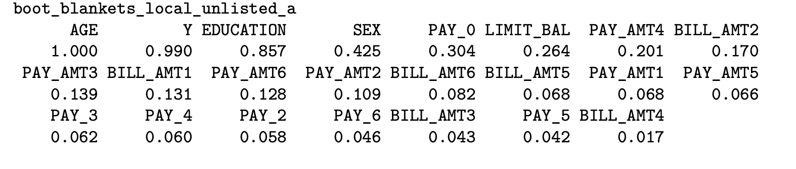
```

```{r rank-pc-markov-blanket-y-boostrapped, echo=FALSE, fig.cap="Rank PC: Bootstrapped Markov Blanket for Y", out.width="75%", fig.align='center'}
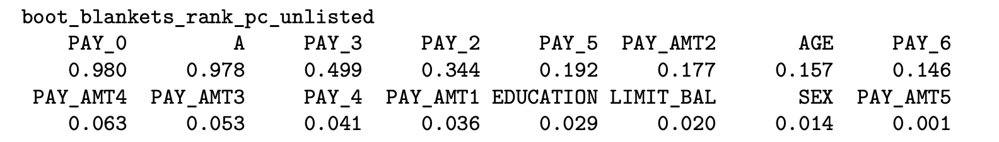
```
```{r rank-pc-markov-blanket-a-boostrapped, echo=FALSE, fig.cap="Rank PC: Bootstrapped Markov Blanket for A", out.width="75%", fig.align='center'}
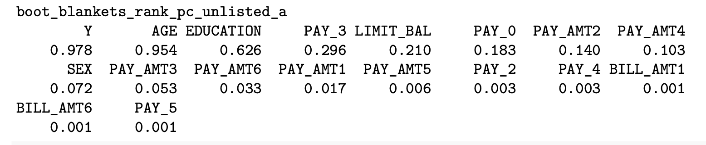
```

```{r pc-limited-covs-markov-blanket-y-boostrapped, echo=FALSE, fig.cap="PC Limited Covariates: Bootstrapped Markov Blanket for Y", out.width="25%", fig.align='center'}
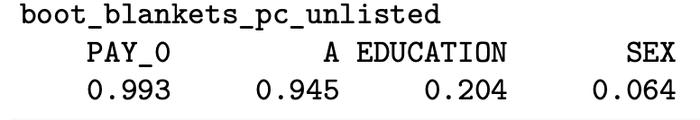
```
```{r pc-limited-covs-markov-blanket-a-boostrapped, echo=FALSE, fig.cap="PC Limited Covariates: Bootstrapped Markov Blanket for A", out.width="50%", fig.align='center'}
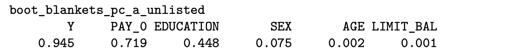
```

```{r pc-all-markov-blanket-y-boostrapped, echo=FALSE, fig.cap="PC All Covariates: Bootstrapped Markov Blanket for Y", out.width="75%", fig.align='center'}
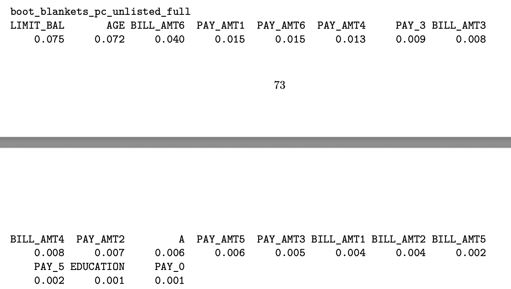
```
```{r pc-all-markov-blanket-a-boostrapped, echo=FALSE, fig.cap="PC All Covariates: Bootstrapped Markov Blanket for A", out.width="75%", fig.align='center'}
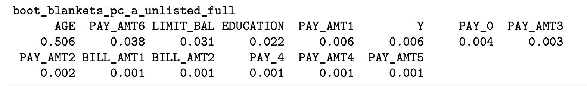
```


## ($\alpha$ = 1%)

```{r full-dag-pc-full-01, echo=FALSE, fig.cap="Full DAG for the PC with all covariates model.", out.width="75%", fig.align='center'}
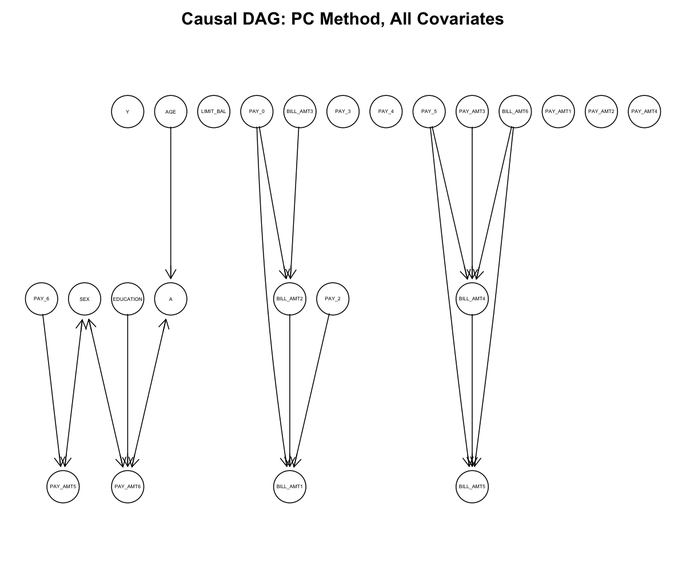
```

```{r full-dag-pc-limited-cov-01, echo=FALSE, fig.cap="Full DAG for the PC with limited covariates model.", out.width="50%", fig.align='center'}
knitr::include_graphics("ANALYSIS_TESTING_1ALPHA_2OPTA/OUTPUT_IMAGES_FROM_ANALYSIS_V6_01/causal_dag_pc_method_bnlearn_limitedcov.png")
```

```{r full-dag-rank-pc-01, echo=FALSE, fig.cap="Full DAG for the Rank PC model.", out.width="75%", fig.align='center'}
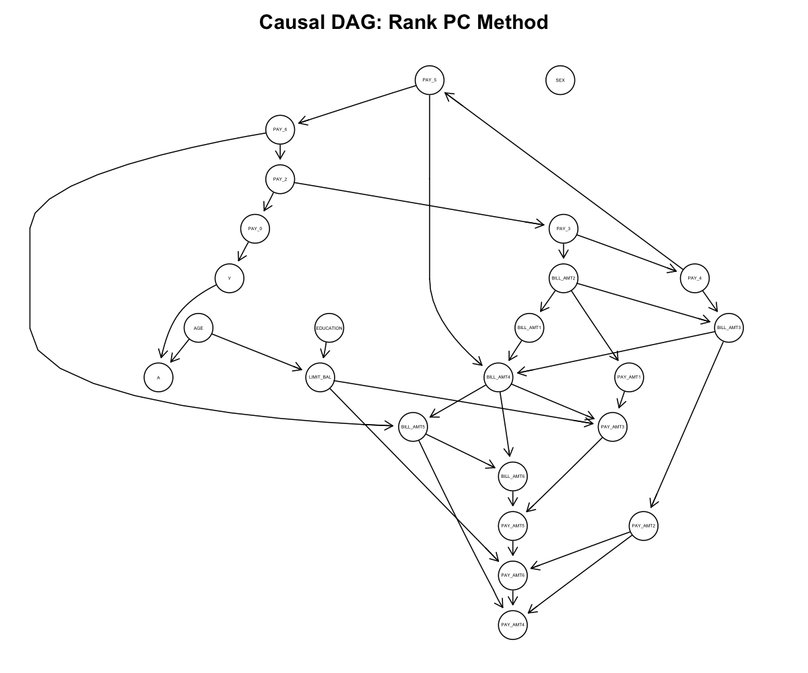
```

```{r local-discovery-markov-blanket-y-boostrapped-01, echo=FALSE, fig.cap="Local Discovery (Inter-IAMB, Ranked Data): Bootstrapped Markov Blanket for Y", out.width="75%", fig.align='center'}
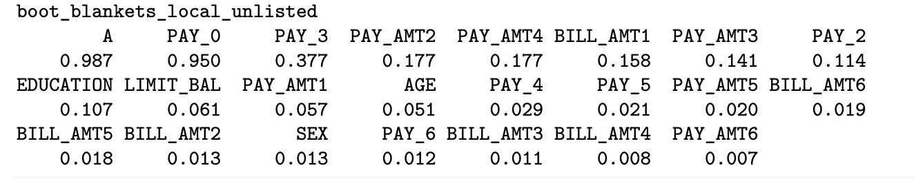
```
```{r local-discovery-markov-blanket-a-boostrapped-01, echo=FALSE, fig.cap="Local Discovery (Inter-IAMB, Ranked Data): Bootstrapped Markov Blanket for A", out.width="75%", fig.align='center'}
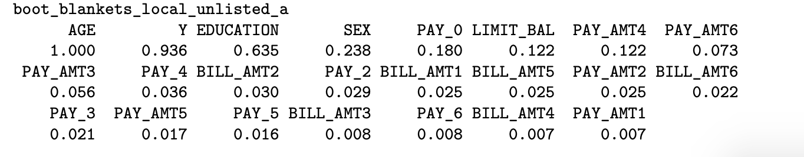
```


## ($\alpha$ = 10%)

```{r full-dag-pc-full-10, echo=FALSE, fig.cap="Full DAG for the PC with all covariates model.", out.width="75%", fig.align='center'}

```

```{r full-dag-pc-limited-cov-10, echo=FALSE, fig.cap="Full DAG for the PC with limited covariates model.", out.width="50%", fig.align='center'}
knitr::include_graphics("ANALYSIS_TESTING_1ALPHA_2OPTA/OUTPUT_IMAGES_FROM_ANALYSIS_V6_01/causal_dag_pc_method_bnlearn_limitedcov.png")
```

```{r full-dag-rank-pc-10, echo=FALSE, fig.cap="Full DAG for the Rank PC model.", out.width="75%", fig.align='center'}

```
```{r local-discovery-markov-blanket-y-boostrapped-10, echo=FALSE, fig.cap="Local Discovery (Inter-IAMB, Ranked Data): Bootstrapped Markov Blanket for Y", out.width="75%", fig.align='center'}
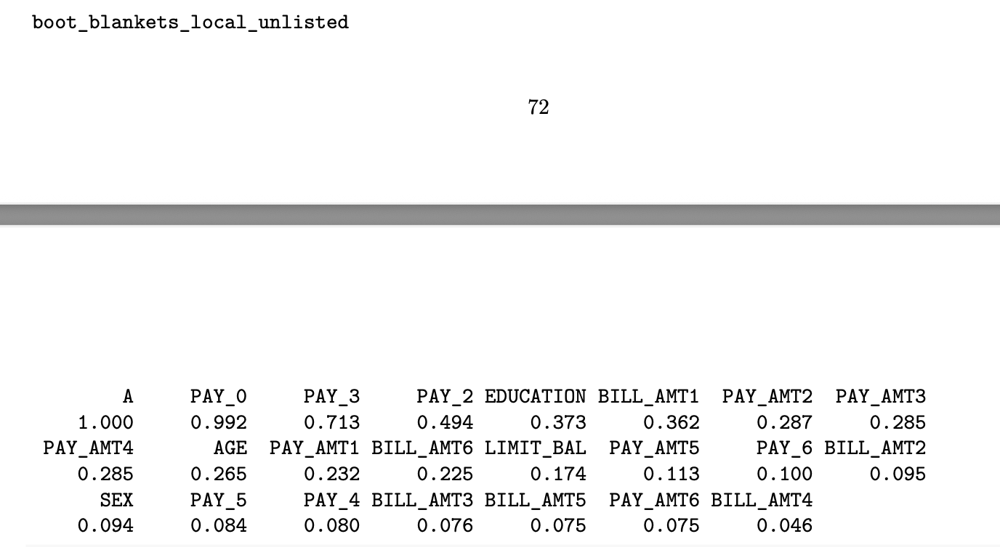
```
```{r local-discovery-markov-blanket-a-boostrapped-10, echo=FALSE, fig.cap="Local Discovery (Inter-IAMB, Ranked Data): Bootstrapped Markov Blanket for A", out.width="75%", fig.align='center'}
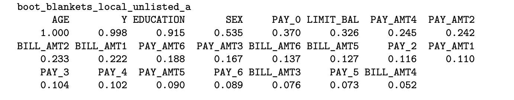
```

